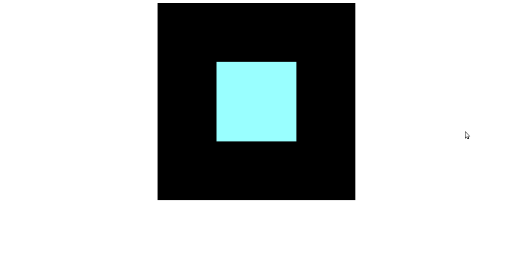

============================
añadiendo objetos
============================

Ahora ya tenemos la escena, pero vacía. En three.js hay dos grandes tipos de figuras, las geométricas o vectoriales, que las puedes generar desde el propio three.js, y las que generas con un editor de gráficos 3D, como blender.

Figuras geométricas
-------------------

Las figuras geometrícas que genera three.js son de las más fáciles de usar.

Vamos a dibujar un cubo:

**Material**

Crear un material, necesitamos utilizar la clase MeshBasicMaterial, que necesita que le indiquemos el color hexadecimal con el que pintar la figura. Vamos a hacer 6 materiales, uno por cara.

.. code-block:: javascript

   var cuboMateriales = [
      new THREE.MeshBasicMaterial({color:0x33FF00}),
      new THREE.MeshBasicMaterial({color:0x00CCFF}),
      new THREE.MeshBasicMaterial({color:0xFF0000}),
      new THREE.MeshBasicMaterial({color:0xFFCC00}),
      new THREE.MeshBasicMaterial({color:0x99FFFF}),
      new THREE.MeshBasicMaterial({color:0xFFFFFF})
   ];
   var cuboMaterial = new THREE.MeshFaceMaterial(cuboMateriales);

Creamos un THREE.MeshFaceMaterial,que contiene los 6 materiales.

**Figura**

.. code-block:: javascript

   var cuboGeometria = new THREE.BoxGeometry(2, 2, 2);

   cubo = new THREE.Mesh(cuboGeometria, cuboMaterial);
   cubo.position.set(0, 0, -7.0);
   escena.add(cubo);

Creamos la geometría del cubo, usando CubeGeometry. Hay que pasar tres valores:
Dimensiones de su ancho (x)
Dimensiones de su alto (y)
Dimensiones de su profundidad (z)

A la clase  new THREE.Mesh, hay que añadir la geometría, y el material. Según el orden de los colores puesto en el material, cambiará la disposición de estos.
La distribución de colores sigue este patrón:
- cara izquierda
- cara derecha
- cara superior
- cara inferior
- cara frontal
- cara posterior

con *position.set* cambiamos las coordenadas del cubo, y con *escena.add* lo añadimos a ella.

El cubo lo tenemos que añadir dentro de la función startEscena, quedando así:

.. code-block:: javascript

   function startEscena(){
   //Render
   render = new THREE.WebGLRenderer(); // definimos el renderizador

   render.setClearColor(0x000000, 1); // el colorde limpieza, negro

   var canvasWidth = 500; // tamaño del canvas
   var canvasHeight = 500; // tamaño del canvas
   render.setSize(canvasWidth, canvasHeight);

   document.getElementById("canvas").appendChild(render.domElement); // indicamos que el render pinte la escena en el div canvas

   //Escena
   escena = new THREE.Scene(); // definimos la escena

   //Camara
   camara = new THREE.PerspectiveCamera(45, canvasWidth / canvasHeight, 0.2, 150); // definimos la camara
   camara.position.set(0, 0, 0); // situamos la cámara en las coordenadas absolutas
   camara.lookAt(escena.position); // le indicamos a la cámara que mire al centro de la escena.
   escena.add(camara); // añadimos la cámara a la escena

   //Cubo
  
   var cuboMateriales = [
    new THREE.MeshBasicMaterial({color:0x33FF00}),
    new THREE.MeshBasicMaterial({color:0x00CCFF}),
    new THREE.MeshBasicMaterial({color:0xFF0000}),
    new THREE.MeshBasicMaterial({color:0xFFCC00}),
    new THREE.MeshBasicMaterial({color:0x99FFFF}),
    new THREE.MeshBasicMaterial({color:0xFFFFFF})
   ];
   var cuboMaterial = new THREE.MeshFaceMaterial(cuboMateriales);

   var cuboGeometria = new THREE.BoxGeometry(2, 2, 2);

   cubo = new THREE.Mesh(cuboGeometria, cuboMaterial);
   cubo.position.set(0, 0, -7.0);
   escena.add(cubo);
  
  
  
  Figuras vectoriales
-------------------

Las figuras vectoriales que genera three.js son de las más fáciles de usar.

Vamos a dibujar un cubo:

**Material**

Crear un material, necesitamos utilizar la clase MeshBasicMaterial, que necesita que le indiquemos el color hexadecimal con el que pintar la figura. Vamos a hacer 6 materiales, uno por cara.

.. code-block:: javascript

   var cuboMateriales = [
      new THREE.MeshBasicMaterial({color:0x33FF00}),
      new THREE.MeshBasicMaterial({color:0x00CCFF}),
      new THREE.MeshBasicMaterial({color:0xFF0000}),
      new THREE.MeshBasicMaterial({color:0xFFCC00}),
      new THREE.MeshBasicMaterial({color:0x99FFFF}),
      new THREE.MeshBasicMaterial({color:0xFFFFFF})
   ];
   var cuboMaterial = new THREE.MeshFaceMaterial(cuboMateriales);

Creamos un THREE.MeshFaceMaterial,que contiene los 6 materiales.

**Figura**

.. code-block:: javascript

   var cuboGeometria = new THREE.BoxGeometry(2, 2, 2);

   cubo = new THREE.Mesh(cuboGeometria, cuboMaterial);
   cubo.position.set(0, 0, -7.0);
   escena.add(cubo);

Creamos la geometría del cubo, usando CubeGeometry. Hay que pasar tres valores:
Dimensiones de su ancho (x)
Dimensiones de su alto (y)
Dimensiones de su profundidad (z)

A la clase THREE.Mesh, hay que añadir la geometría, y el material. Según el orden de los colores puesto en el material, cambiará la disposición de estos.
La distribución de colores sigue este patrón:
- cara izquierda
- cara derecha
- cara superior
- cara inferior
- cara frontal
- cara posterior

con *position.set* cambiamos las coordenadas del cubo, y con *escena.add* lo añadimos a ella.

El cubo lo tenemos que añadir dentro de la función startEscena, quedando así:

.. code-block:: javascript
   function startEscena(){
   //Render
   render = new THREE.WebGLRenderer(); // definimos el renderizador

   render.setClearColor(0x000000, 1); // el colorde limpieza, negro

   var canvasWidth = 500; // tamaño del canvas
   var canvasHeight = 500; // tamaño del canvas
   render.setSize(canvasWidth, canvasHeight);

   document.getElementById("canvas").appendChild(render.domElement); // indicamos que el render pinte la escena en el div canvas

   //Escena
   escena = new THREE.Scene(); // definimos la escena

   //Camara
   camara = new THREE.PerspectiveCamera(45, canvasWidth / canvasHeight, 0.2, 150); // definimos la camara
   camara.position.set(0, 0, 0); // situamos la cámara en las coordenadas absolutas
   camara.lookAt(escena.position); // le indicamos a la cámara que mire al centro de la escena.
   escena.add(camara); // añadimos la cámara a la escena

   //Cubo
  
   var cuboMateriales = [
    new THREE.MeshBasicMaterial({color:0x33FF00}),
    new THREE.MeshBasicMaterial({color:0x00CCFF}),
    new THREE.MeshBasicMaterial({color:0xFF0000}),
    new THREE.MeshBasicMaterial({color:0xFFCC00}),
    new THREE.MeshBasicMaterial({color:0x99FFFF}),
    new THREE.MeshBasicMaterial({color:0xFFFFFF})
   ];
   var cuboMaterial = new THREE.MeshFaceMaterial(cuboMateriales);

   var cuboGeometria = new THREE.BoxGeometry(2, 2, 2);

   cubo = new THREE.Mesh(cuboGeometria, cuboMaterial);
   cubo.position.set(0, 0, -7.0);
   escena.add(cubo);

Resultado
---------
Si abrimos el archivo index.html en el navegador, veremos algo como esto:

