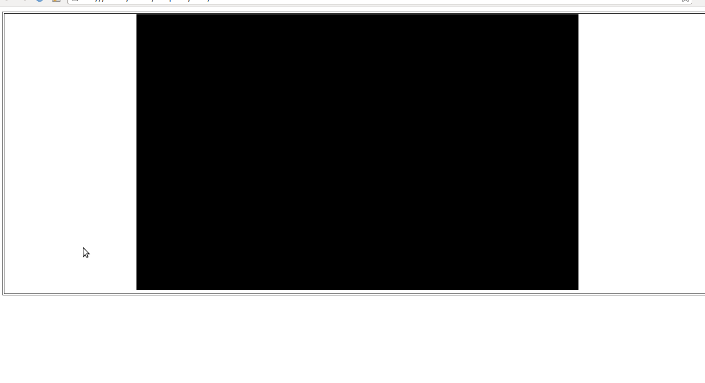

============================
Creando una escena
============================

Separaremos la parte estética, que contiene el canvas con la parte lógica que contendrá la manipulación del cubo.

Parte estética
--------------

Estará en el archivo index.html, y será el archivo "ejecutable".

.. code-block:: html

    <!DOCTYPE html>
    <html>
    <head>
    <title>Cubo en three.js</title>
    <meta http-equiv="content-type" content="text/html; charset=utf-8">
     
     <!-- archivo que contendrá la parte lógica -->
    </head>
    <body onload="webGLStart();">
    

    </body>
    </html>

Parte lógica
--------------

Estará en el archivo javascript.js, está dentro de la carpeta js.

.. code-block:: javascript

   var escena;
   var camara;
   var render;

   function startEscena(){
     //Render
     render = new THREE.WebGLRenderer(); // definimos el renderizador

     render.setClearColor(0x000000, 1); // el colorde limpieza, negro

     var canvasWidth = 500; // tamaño del canvas
     var canvasHeight = 500; // tamaño del canvas
     render.setSize(canvasWidth, canvasHeight);

     document.getElementById("canvas").appendChild(render.domElement); // indicamos que el render pinte la escena en el div canvas

     //Escena
     escena = new THREE.Scene(); // definimos la escena

     //Camara
     camara = new THREE.PerspectiveCamera(45, canvasWidth / canvasHeight, 0.2, 150); // definimos la camara
     camara.position.set(0, 0, 0); // situamos la cámara en las coordenadas absolutas
     camara.lookAt(escena.position); // le indicamos a la cámara que mire al centro de la escena.
     escena.add(camara); // añadimos la cámara a la escena

    
   }
   function renderEscena(){
     render.render(escena, camara); // para dibujar la escena
   }

   function webGLStart() { //función llamada cuando se carga la página (onload)
      startEscena();
      renderEscena();
   }
   
   

Respecto a la cámara, para crear una PerspectiveCamera necesitaremos poner cuatro opciones:

- Ángulo del campo de visión en grados
- Ratio de aspecto, que normalmente es la relación entre el WIDTH y el HEIGHT del canvas donde se va a renderizar la imagen
- Distancia mínima de dibujado
- Distancia máxima de dibujado

Resultado
---------
Si abrimos el archivo index.html en el navegador, veremos algo como esto:

El canvas negro es la escena, y se ve negro ya que no hemos añadido ningún objeto.

