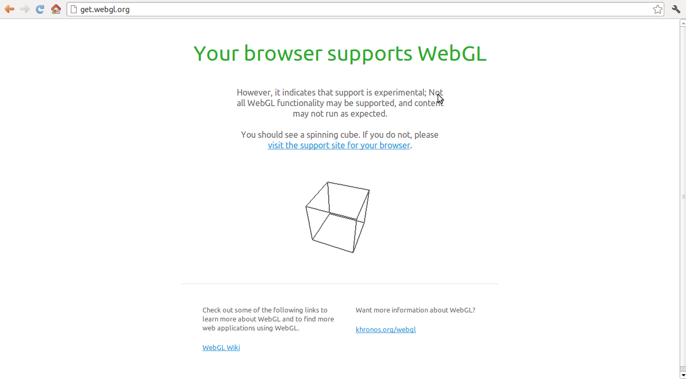

============================
Preparando el terreno
============================
Para poder utilizar Javascript o cualquiera de sus librerías, no necesitamos instalar nada, pero si habilitar 
en el navegador la utilización de WebGL.

* Google Chrome

* * **Paso 1:** Abre el navegador y en la barra de direcciones escribe: chrome://flags/ 

* * **Paso 2:** Desde esta página podemos habilitar soporte adicional al navegador web, en nuestro caso para WebGL, necesitas habilitar los siguientes experimentos: 

* * * WebGL (Importante)
* * * Ignorar la lista de renderización por software (Opcional si no funciona con el primero)
* * * Canvas 2D acelerado por GPU (opcional)

* * **Paso 3:** Reinicia el navegador.

* Firefox

* * **Paso 1:** Abre el navegador y en la barra de direcciones escribe: about:config 

* * **Paso 2:** Desde esta página podemos habilitar soporte adicional al navegador web, en nuestro caso para WebGL, necesitas habilitar los siguientes experimentos: 

* * * webgl.force-enabled. (importante)
* * * layers.acceleration.force-enabled --> solo en windows
* * * gfx.direct2d.force-enabled --> solo en windows 
* * **Paso 3:** Reinicia el navegador.

Una vez habilitado, abre esta página. `get.webgl.org <http://get.webgl.org/>`_ , te debería salir algo así:

